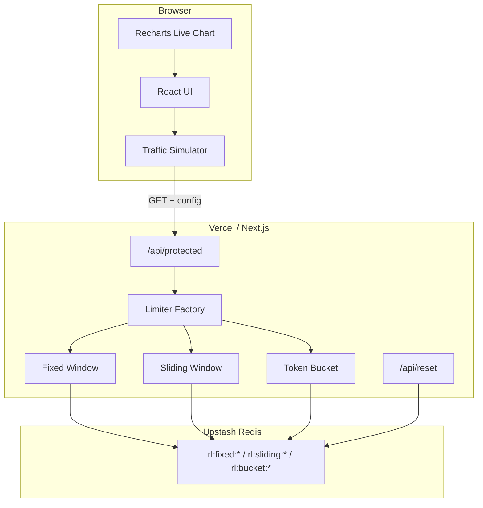

# Rate Limiter Visualizer

A live, visual rate limiter demo built with Next.js, TypeScript, Tailwind CSS, and Upstash Redis. Hammer a real protected API endpoint, watch requests get allowed or throttled in real time, and switch between algorithms to see how behavior changes.

**Why this project?** Most fresher portfolios show CRUD apps. This one demonstrates system design fundamentals — pluggable rate-limiting strategies, Redis-backed state that survives serverless cold starts, and a UI that makes tradeoffs visible.

## Live demo

https://rate-limiter-five-blush.vercel.app/


## Architecture



### Request flow

1. User configures limit, window, burst capacity, algorithm, and mock client ID in the UI.
2. Traffic simulator fires `GET /api/protected?algorithm=...&clientId=...&limit=...`.
3. API route instantiates the selected limiter via the **strategy pattern** (`RateLimiter` interface).
4. Limiter reads/writes Redis keys keyed by `clientId` — per-client isolation.
5. Response is `200` (allowed) or `429` (throttled) with `X-RateLimit-*` headers.
6. UI logs each result and feeds Recharts for a live allowed vs blocked chart.

## Algorithms

### Fixed Window

Divides time into fixed buckets (e.g. minute 0:00–0:59). Each bucket has a counter in Redis (`INCR` + `PEXPIRE`).

| Pros | Cons |
|------|------|
| O(1) memory per client | **Boundary burst**: 10 req/min can allow 20 at the window edge |
| Simple, fast | Less accurate than sliding window |

**Interview talking point:** Great when approximate limiting is fine and you want minimal Redis ops.

### Sliding Window

Stores request timestamps in a Redis sorted set. On each check, prune entries older than the window (`ZREMRANGEBYSCORE`), count remaining (`ZCARD`), then add the new timestamp (`ZADD`).

| Pros | Cons |
|------|------|
| Accurate rolling limit | O(n) memory per client (one entry per request in window) |
| No boundary burst problem | More Redis operations per request |

**Interview talking point:** Use when fairness matters more than memory — e.g. strict API quotas.

### Token Bucket

Stores `{ tokens, lastRefill }` in a Redis hash. Tokens refill continuously at `limit / windowMs` rate, capped at burst capacity. Each allowed request consumes one token.

| Pros | Cons |
|------|------|
| Smooth burst handling | Slightly more complex refill math |
| Allows controlled bursts | Tunable via burst vs refill rate |

**Interview talking point:** Ideal for APIs that should tolerate short bursts (mobile clients, batch uploads) while maintaining average throughput.

## Strategy pattern

All limiters implement the same interface:

```typescript
export interface RateLimiter {
  check(identifier: string): Promise<RateLimitResult>;
}
```

The factory (`createLimiter`) selects the implementation at runtime based on the `algorithm` query param. Adding a new algorithm = one new class + one factory case — no changes to the API route or UI contract.

## Setup

### 1. Clone and install

```bash
git clone <your-repo>
cd rate-limiter
npm install
```

### 2. Upstash Redis

1. Create a free database at [upstash.com](https://upstash.com)
2. Copy `.env.local.example` to `.env.local`
3. Add your credentials:

```env
UPSTASH_REDIS_REST_URL=https://...
UPSTASH_REDIS_REST_TOKEN=...
```

### 3. Run locally

```bash
npm run dev
```

Open [http://localhost:3000](http://localhost:3000).

### 4. Deploy to Vercel

1. Push to GitHub
2. Import project in Vercel
3. Add `UPSTASH_REDIS_REST_URL` and `UPSTASH_REDIS_REST_TOKEN` as environment variables
4. Deploy

## API

### `GET /api/protected`

| Param | Description |
|-------|-------------|
| `algorithm` | `fixed-window` \| `sliding-window` \| `token-bucket` |
| `clientId` | Mock client identifier (per-client isolation) |
| `limit` | Max requests per window |
| `windowMs` | Window duration in milliseconds |
| `burstCapacity` | Max tokens for token bucket |

**Response headers:** `X-RateLimit-Limit`, `X-RateLimit-Remaining`, `X-RateLimit-Reset`

### `POST /api/reset`

Clears Redis rate-limit keys. Optional body:

```json
{ "clientIds": ["client-alpha"] }
```

Omit `clientIds` to clear all `rl:*` keys.

## Testing

```bash
npm test
```

Unit tests mock Redis and verify allow/block behavior, client isolation, and token refill for each algorithm.

## Project structure

```
src/
├── app/
│   ├── api/protected/route.ts   # Protected endpoint
│   ├── api/reset/route.ts       # Dev reset
│   └── page.tsx                 # Dashboard
├── components/
│   ├── AlgorithmSwitcher.tsx
│   ├── ConfigPanel.tsx
│   ├── ClientSelector.tsx
│   ├── TrafficSimulator.tsx
│   └── LiveChart.tsx
└── lib/limiters/
    ├── types.ts                 # RateLimiter interface
    ├── factory.ts               # Strategy factory
    ├── fixedWindow.ts
    ├── slidingWindow.ts
    ├── tokenBucket.ts
    └── redis.ts                 # Upstash client
```

## Future work

- **Distributed multi-region rate limiting** — current design uses a single Upstash region; global apps would need synchronized counters or regional buckets with sync (e.g. Redis CRDTs, or a central coordination layer).
- **Persistent analytics** — session-only chart data today; could stream to TimescaleDB or ClickHouse for historical dashboards.
- **Leaky bucket / sliding window counter** — hybrid algorithms for memory-efficient sliding approximations.

## License

MIT
